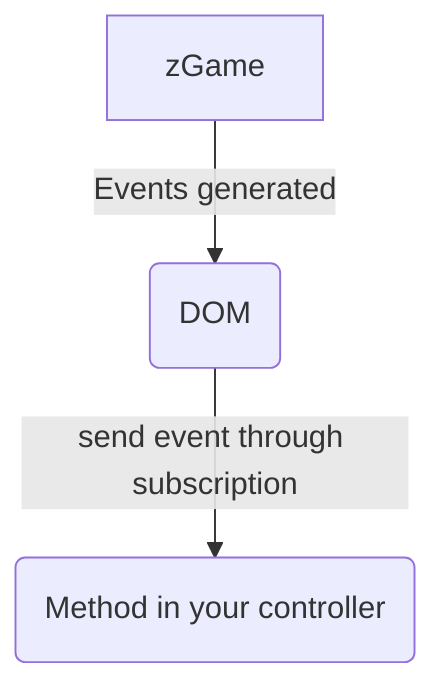
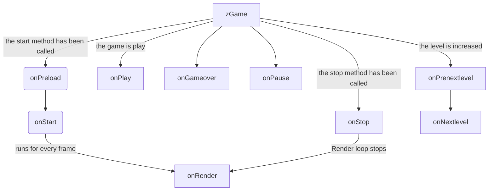
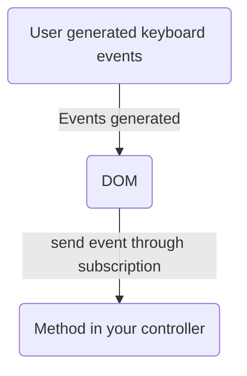

# Street Zero

   

## Coverage

| Statements                                                                           | Branches                                                                       | Functions                                                                           | Lines                                                                       |
| ------------------------------------------------------------------------------------ | ------------------------------------------------------------------------------ | ----------------------------------------------------------------------------------- | --------------------------------------------------------------------------- |
|  |  |  |  |

Streetzero is a micro framework for creating 2d video games in the browser.

Streetzero uses the canvas and browser events for the game lifecycle and for user events.

This framework is not designed for a production environment, it is currently in the experimental stage.

# How to start

---

## Instalation

---

1. Install package:

```bash
npm i streetzero -g
```

## Make Project

1. run streetzero CLI

```bash
streetzero
```

2. Select the option 1.

```bash
====================================
STREET ZERO - MAIN MENU
====================================
? What do you need to do? (Use arrow keys)
❯ 1.- Start a new project.
  2.- Create new component.
```

3. Write your name project.

```bash
====================================
STREET ZERO - INIT PROJECT MENU
====================================
? Name: YourNewProject
```

<b>Note:</b>
After entering the name and if you have done everything right, you will receive a "success" message on the console.

## Run

---

1. Move from the console to the project folder.

```bash
cd your_project_folder_path
```

2. Insall packages

```bash
npm install
```

3. run server

```bash
npm start
```

---

## Dependency Injection (IOC)

---

Now streetzero uses inversify under the hood, so you can get controller instances, and streetzero components via the @inject decorator.

You can read more about inversify [here](https://https://inversify.io/).

classes that implement the @Controller or @Injectable decorator will be automatically linked into zEngine. Streetzero uses the inversify configuration `autoBindInjectable: true`

---

## zGame

---

Existe una instancia unica

### Attributes

---

| Attribute                         |                                                                                                                                                                                                 Description                                                                                                                                                                                                 |
| :-------------------------------- | :---------------------------------------------------------------------------------------------------------------------------------------------------------------------------------------------------------------------------------------------------------------------------------------------------------------------------------------------------------------------------------------------------------: |
| start()                           |                                                                                                                                           Start the life cycle of the game. This method starts the frame rate loop that allows the game graphics to be rendered.                                                                                                                                            |
| stop()                            |                                                                                                                                                                                      Stopt the life cycle of the game.                                                                                                                                                                                      |
| play()                            |                                                                                                                                                                                      Set the`isPlay` property to true                                                                                                                                                                                       |
| pause()                           |                                                                                                                                                                                      Set the`isPlay` property to false                                                                                                                                                                                      |
| clearCanvas()                     |                                                                                                                                                                     Remove all elements rendered at the current frame within the canvas                                                                                                                                                                     |
| nextLevel(sleepOffset)            |                                                                                                                                                                                            Pending documentation                                                                                                                                                                                            |
| incrementPoints(increase?:number) |                                                                                                                     Allows to increase an amount by means of the`increase` parameter, if the `increase` parameter is not set, it will increase the value of the `points` property by 1                                                                                                                      |
| gameover                          |                                                                                                                         Boolean property, allows to obtain or set the value of the gameover state. Setting this property to`true` or `false` will not start or stop the game loop.                                                                                                                          |
| isPlay                            |                                                                             Boolean property, it allows to obtain the value of the true play property, this property is immediately after the play method is called, and it is false when the play method has not been called or immediately after the pause method is called.                                                                              |
| speed                             | Property of type number, allows obtain or setting the value of the speed at which the cycle of ticks per second is executed,<br>**Example**. If we set the speed to 60, that's roughly 60 frames per second. If you want to accurately get the actual number of frames per second use the `fps` property. <br>**Warning:** The value of the speed property must be set before calling the `start()` method. |
| points                            |                                                                                                                                Property of type number, It allows to obtain the accumulated points of the game. You can edit this property using the method`incrementPoints`                                                                                                                                |
| level                             |                                                                                                                                      Property of type number, It allows to obtain the value of the current game level. This value is edited via the`nextLevel` method.                                                                                                                                      |
| initTime                          |                                                                                                                                        Property of type number, allows to obtain the timestamp, in millisecods format, registered when calling the`start()` method.                                                                                                                                         |
| fps                               |                                                                                                                           Property of type number, it allows to obtain the rate of average frames per second (fps). This value is updated over the course of the game execution.                                                                                                                            |
| context                           |                                                                                                                                                                                 allows obtain the CanvasRenderingContext2D.                                                                                                                                                                                 |
| canvas                            |                                                                                                                                                                                       allow obtain the canvas object                                                                                                                                                                                        |

---

## Game Events

---

Implement the GameEvents interface in your controller class and override the event methods.

### Lifecycle

Game events are generated from the zGame class, and are dispatched via browser events to its controller class.



This is the cycle of events that are triggered from zGame.



| Event            |                                     Description                                     |
| :--------------- | :---------------------------------------------------------------------------------: |
| onStart()        | This event is called when start is called and it starts the lifecycle of streetzero |
| onStop()         |   This method is executed when the `stop` function of the parent class is called.   |
| onPlay()         |            This event is called when the game has changed to a `played`.            |
| onPause()        |         This event is called when the game has changed to a `paused` state.         |
| onGameover()     | This method is executed when the `gameOver` function of the parent class is called. |
| onPreload()      |                                Pending documentation                                |
| onRender()       |                                Pending documentation                                |
| onNextlevel()    |                                Pending documentation                                |
| onPrenextlevel() |                                Pending documentation                                |

---

## Mouse Events

---

### Lifecycle



Overwrite any of these methods within your MyGame class

| Event              |                             Description                             |
| :----------------- | :-----------------------------------------------------------------: |
|                    |                                                                     |
| onClick(event)     | Este metodo es llamado cuando se detecta el evento`click` del mouse |
| onMousemove(event) |                        Pending documentation                        |

## Mouse Events

Overwrite any of these methods within your MyGame class

| Event               |      Description      |
| :------------------ | :-------------------: |
|                     |                       |
| onKeyDown(event)    | Pending documentation |
| onKeyUp(event: any) | Pending documentation |

## Drawable Objects

---

### Pending documentation

---

## Kinematiks

---

This is the class that is in charge of managing the physics and location of the elements within the scenario.

Note: This implementation will change in the final version.

In the final version, it is expected that this class will be implemented through a decorator and that it will support the use of both path and jpg and png images.

---

Example rocket.class.ts:

```typescript
import { Kinematic, LayerPath } from 'streetzero';

export class Rocket extends Kinematic {
    private _primaryColor;
    constructor(canvas: HTMLCanvasElement, color: string, x: number, y: number) {
        Sounds.shoot();
        super(canvas, x, y, 30, 10);
        this._primaryColor = color;
        super.enabledGravity = false;
        this.initLayer();
    }
    initLayer() {
        const shoot = new Path2D();
        const center = 5;
        shoot.moveTo(0, center - 2);
        shoot.lineTo(20, center - 2);
        shoot.lineTo(25, center);
        shoot.lineTo(20, center + 2);
        shoot.lineTo(0, center + 2);
        shoot.lineTo(0, center - 2);
        shoot.closePath();

        const flame = new Path2D();
        flame.ellipse(0, center, 10, 4, 0, 0, Math.PI * 2); // llama

        const flame2 = new Path2D();
        flame2.ellipse(2, center, 8, 2, 0, 0, Math.PI * 2); // llama

        super.setLeyers([new LayerPath(shoot, this._primaryColor, this), new LayerPath(flame, 'red', this), new LayerPath(flame2, 'yellow', this)]);
    }

    hasColision(element: Kinematic) {
        if (super.hasColision(element)) {
            super.destroy();
            return true;
        }
        return false;
    }
}
```

---

## Controllers

---

Controllers are where you can access all the events available in streetzero. To use any of the events, you just have to overwrite the name of the event you want to consume.

It is recommended that you use the available interfaces: `GameEvents`, `MouseEvents` y `TouchEvents`.

### script: game.controller.ts

```typescript
import { math, Controller, DOMContext, Game, zGame, GameEvents, MouseEvents } from 'streetzero';
import { inject } from 'inversify';

@Controller()
export class ShotLevelController implements GameEvents, MouseEvents {
    private context: CanvasRenderingContext2D | null;
    private canvas: HTMLCanvasElement | null;
    private _rockets: Rocket[] = [];
    constructor(@inject(DOMContext) { context, canvas }: DOMContext, @inject(zGame) private game: zGame) {
        this.context = context;
        this.canvas = canvas;
    }
    onClick(event: any): void {
        console.log('onClick');
    }
    onRender() {
        this._rockets.forEach((rocket) => {
            rocket.move();
            rocket.render();
        });
        this._rockets = this._rockets.filter((rocket) => rocket.x < this.canvas.width && !rocket.isDestroy());
        super.render();
    }
    onMousemove(event: any): void {}
    onMousedown(event: any): void {}
    onMouseup(event: any): void {}
    onMouseout(event: any): void {}
    onStop(): void {}
    onStart(): void {}
    onPreload(): void {}
    onPause(): void {}
    onPrenextlevel(): void {}
    onPlay(): void {}
    onGameover(): void {}
    onNextlevel() {}
}
```

---

## zEngine

---

zEngine is the class in charge of managing the IOC container, so it is the one in charge of managing inversify to indicate which classes should be called.

This class is a singleton so there will only be one instance during the entire execution cycle of streetzero.

All controllers within your application should be passed in an array to zEngine via the initialize method.

```typescript
import { zEngine, zGame } from 'streetzero';
import { ShotLevelController } from './controllers/game.space.class';

const engine = zEngine.initialize([ShotLevelController /* ...OTHER CONTROLLER*/]);
const game: zGame = engine.ioc.get(zGame);
game.start();
game.play();
```

# Autor

## Addison Calles
